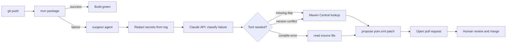

# pipeline-surgeon-labs

> A diagnostic agent for Maven CI pipeline failures. Reads build logs, uses
> Claude to classify the failure, and proposes a fix as a pull request.
> Currently handles three failure classes; designed to be extended.

[](https://github.com/Kanim21/pipeline-surgeon-labs/actions/workflows/auto-heal.yml)
[](LICENSE)
[](https://www.anthropic.com)

## What this is

When a Maven build fails in CI, this agent reads the build log, classifies
the failure type, and opens a pull request with a proposed fix. It does not
auto-commit to `main` — every fix goes through human review.

The point isn't that it fixes everything. The point is that it demonstrates
the shape of LLM-assisted CI/CD remediation: structured failure classification,
scoped tool use, pull-request output, and budgeted reasoning. The same pattern
extends to npm, pip, Go, and beyond — Maven is the starting surface.

## How it works



**Per-failure flow:**

1. CI runs `mvn package`. If it succeeds, nothing happens.
2. On failure, the workflow invokes the surgeon agent with the build log.
3. The agent runs the log through a secret redactor before any external call.
4. The agent calls Claude with a structured-output contract: classify the
   failure into one of three known classes (or `unknown`), and explain.
5. Based on classification, the agent uses one of two tools:
   - **`search_maven_central`** — looks up a package's canonical coordinates
   - **`read_source_file`** — reads a Java file referenced in a compile error
6. The agent generates a unified diff for `pom.xml` or a source file.
7. The workflow opens a pull request with the proposed fix, the agent's
   diagnosis, and Claude's confidence score.
8. A human reviews and merges (or rejects).

## What's actually built (Phase 1)

- **LLM-powered classification** via the Anthropic API (Claude Sonnet 4.6),
  using tool use for structured output.
- **Three failure classes:**
  - `missing_dependency` — `package X.Y.Z does not exist`
  - `version_conflict` — Maven enforcer or dependency resolution conflicts
  - `compilation_error` — `cannot find symbol`, `cannot resolve method`, etc.
- **Two tools the agent can call:**
  - `search_maven_central(query)` — returns top 3 matches with version metadata
  - `read_source_file(path, line_range)` — reads bounded chunks of source
- **Secret redactor** runs on the build log before any data leaves the runner.
  Strips AWS access keys, GitHub tokens, URLs with embedded credentials, and
  common API key patterns.
- **Pull-request output** via `peter-evans/create-pull-request` — no
  auto-commit to `main`, ever.
- **Token budget per run** (8K input + 2K output) — hard cap prevents
  runaway costs on noisy logs.
- **Test corpus** in `tests/fixtures/` — 6 known-failure cases (2 per class),
  used to validate classification accuracy in CI.

## What's deliberately not built yet

This is Phase 1. The following are scoped for later phases and explicitly
not present today:

- **Multi-step reasoning loop.** Current agent does one classification pass
  and one fix proposal. No "try, observe, adjust" iteration. Phase 2.
- **Sandbox execution of fix attempts.** Agent proposes, never executes.
  Adding `run_maven_command` as a tool requires sandboxing decisions. Phase 2.
- **Test-failure classification.** Test failures span too many subtypes
  (logic, flake, mock setup, env) to handle reliably with a single prompt.
  Phase 2 with subclassification.
- **Multi-language support.** Maven only. npm, pip, Go are Phase 3.
- **Allowlists and signed commits.** Currently any Maven Central match is
  fair game in a proposed PR. Production usage needs trust gates. Phase 3.
- **A human-readable failure dashboard.** Today, the audit trail is the
  PR description and CI logs. Phase 3.

## Architecture

### The agent prompt

The system prompt scopes Claude to the role and forbids hallucination of
package names:

```
You are a Maven CI failure diagnostician. You will be given a build log.
Your job:

1. Classify the failure into exactly one of: missing_dependency, version_conflict, compilation_error, or unknown.
2. If you need more information, call the appropriate tool. Do not invent package names, file contents, or line numbers — use tools to find them.
3. Output a structured diagnosis with: failure_class, root_cause, confidence (0.0-1.0), proposed_fix (a unified diff), and reasoning.
4. If the build log appears to contain secrets or PII, do not echo them back in your reasoning. The log has been pre-redacted, but treat any residual secret-like strings as untrusted.

If confidence is below the configured threshold, return failure_class='unknown' and explain what additional information would be needed.
```

### The output contract

Claude returns a `Diagnosis` tool call with this schema:

```json
{
  "failure_class": "missing_dependency | version_conflict | compilation_error | unknown",
  "root_cause": "string",
  "confidence": 0.0,
  "proposed_fix": "unified diff as a string, or null",
  "target_file": "pom.xml | path/to/Source.java | null",
  "reasoning": "string explaining the diagnosis"
}
```

The agent code only acts if `confidence >= threshold` (default 0.6) and
`proposed_fix` is non-null. Below threshold, it opens a PR titled
`[surgeon] unable to diagnose` with the reasoning attached for human review.

### Tool surface

Each tool is implemented as a Python function and registered with the
Anthropic SDK's tool-use API. The agent does not have shell access, file
write access, or arbitrary HTTP access — only the two tools.

- `search_maven_central(query: string)` returns top 3 matches with `groupId`,
  `artifactId`, `version`, last-published date. Read-only HTTP to
  `search.maven.org`.
- `read_source_file(path: string, line_range: [int, int])` returns up to 200
  lines of file content. Must be under the repo root; rejects symlinks.

### Where it runs

Inside the GitHub Actions runner that ran the failing build. No persistent
infrastructure. The Anthropic API key is a repo secret (`ANTHROPIC_API_KEY`),
scoped to the surgeon-agent job only.

## Trade-offs

**Claude over OpenAI.** Both work for this. Chose Claude because the tool-use
API has stricter schema validation (the agent can't return malformed JSON and
keep going), and because the `claude-sonnet-4-6` model is current as of build
time. The agent is model-agnostic in design — swapping to GPT-4 would be
~50 lines of changes in `surgeon/llm.py`.

**PR output over auto-commit.** The original prototype auto-pushed fixes to
`main`. That's dangerous: a malicious or hallucinated dependency lands without
review. Every fix now goes through a PR, the diff is visible, and a human must
merge. Slower, but the only defensible posture for a CI tool that modifies
your code.

**Maven only, for now.** Maven failures have a well-defined log format and
Maven Central is a well-defined lookup target. npm/pip generalize the pattern
but introduce new variables (lockfiles, monorepo configs). Better to nail one
language before generalizing.

**No retry loop.** When the agent fails, the workflow doesn't retry. Phase 1
treats agent failure as "human takes over." Phase 2 adds bounded retries with
backoff.

## Measured results

Populated at the end of Phase 1, after running the agent against the test
fixture corpus.

- Classification accuracy by failure class: TBD
- Confidence threshold calibration (sweep from 0.3 to 0.9): TBD
- Cost per successful diagnosis: TBD
- Cost per unknown classification: TBD

## Quick start

### Prerequisites

- Anthropic API key
- GitHub repo with Actions enabled
- A Maven project (the included demo works, or your own)

### Setup

1. Fork or clone this repo.
2. Add `ANTHROPIC_API_KEY` as a repository secret
   (Settings → Secrets and variables → Actions → New repository secret).
3. The workflow already has `pull-requests: write` permission. No other config.

### Trigger a failure to see the agent run

The included `pom.xml` has a deliberate version conflict on `commons-lang3`.
Push any change to `main`:

```
git commit --allow-empty -m "trigger demo build"
git push
```

The Actions tab will show the build failing, then the agent running, then a
PR appearing within ~30 seconds.

### Local development

```
python3 -m venv .venv && source .venv/bin/activate
pip install -r requirements.txt
export ANTHROPIC_API_KEY=sk-ant-...
python3 -m surgeon.agent --log tests/fixtures/missing_dep_01.log --dry-run
pytest tests/
```

## Testing

Each fixture in `tests/fixtures/` is a real Maven build log captured from a
deliberately broken build. Naming: `tests/fixtures/<class>_<sequence>.log`
paired with `tests/fixtures/<class>_<sequence>.expected.json`. The
`.expected.json` contains the diagnosis the agent should produce (modulo
`reasoning`, which is checked for keywords rather than exact match because
LLM output varies).

Adding a new fixture: write or capture a failing Maven build log into
`tests/fixtures/`. Run the agent against it manually with `--dry-run` and
inspect the output. If correct, save the diagnosis as the `.expected.json`.
Add an entry to `tests/test_classifications.py`.

CI assertions: the workflow runs `pytest tests/` on every push. The
classification test asserts `failure_class` matches exactly,
`confidence >= threshold` for known-good fixtures, `target_file` matches
exactly, and top 3 keywords from `reasoning` are present (loose check;
LLMs vary).

## Roadmap

**Phase 2 — Tool-using loop** (1-2 weeks of work):
- Multi-step reasoning: the agent can call tools iteratively, observe results,
  and refine its diagnosis up to a budget cap.
- Add `run_maven_command` (sandboxed) for diagnostic commands like
  `mvn dependency:tree`.
- Test-failure classification with subclasses (logic / flake / mock / env).
- ADR-001 documenting the agent loop design and budget rationale.

**Phase 3 — Production posture** (2-3 weeks):
- Multi-language: add npm as the second supported pipeline type.
- Allowlists for Maven Central publishers (and equivalents per ecosystem).
- Signed commits for agent-authored PRs.
- Cost controls: per-run token budget, per-repo daily ceiling, alerts.
- Observability: structured logging of every classification with outcome.
- A fixture corpus of 30+ failures across all supported failure classes.

## Security notes

- **API key handling:** `ANTHROPIC_API_KEY` is a GitHub repo secret. It is
  injected only into the surgeon-agent job, not into build jobs. Anyone with
  push access to this repo can in principle exfiltrate it via a malicious PR;
  for a single-maintainer portfolio repo this is acceptable. Production
  deployments should use OIDC + a managed secret store.
- **No auto-commit.** The agent opens pull requests. It cannot commit to
  `main` directly.
- **Bounded tool surface.** The agent has two tools, both with read-only
  external access and tight input validation. No shell, no file writes, no
  arbitrary HTTP.
- **Token caps.** Every run is capped at 8K input + 2K output tokens.
- **Log redaction.** Build logs sometimes leak secrets. Before sending the
  log to Claude, the agent runs it through a redactor that strips anything
  matching common secret patterns (AWS keys, GitHub tokens, URLs with
  passwords). Redaction is logged but not exposed externally.

## License

MIT. See [LICENSE](LICENSE).
